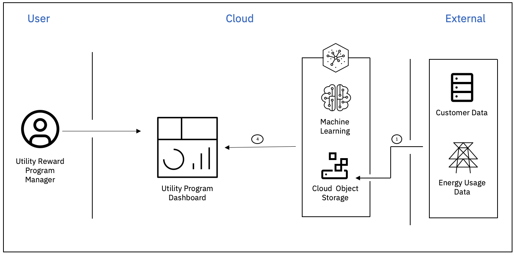

# Overview

We all dream of a green and healthy world. Florida's eight thousand miles of beautiful coastline are a living example of that world. Unfortunately, Florida also has one of the largest per capita consumptions of energy in the United States. The bulk of this energy is generated from fossil fuels leading to high carbon emissions. To contribute to a healthier Florida, we have to encourage more energy conservation and using energy efficiently. 

# Possible Solution

Introduce a discount program where opt-in customers are offered discounted energy rates when they reduce or cycle down energy load during peak consumption periods.
Some existing demand response system in Florida for reference can be found [here](https://www.arup.com/projects/tallahassee-automated-demand-response-program).

# Idea

Identify customers who can opt for a discount program based on the customer profile and energy usage history. By identifying customers who would be likely adopters, promotions can be targeted to them. 

## Architecture

## Solution Flow

- Access the customer profile and energy usage data stored in the Cloud Object Storage inside Watson Studio
- Create a model that predicts customers who are likely to enroll in the reward program
- Deploy the tested model on Watson Studio and get the endpoint URL
- Create a R-Studio dashboard to view the model result and selected customer profile

# Resources

## IBM Developer Sample App & Workshop
- [IBM Cloud Pay-As-You-Go Account](https://ibm.biz/ufhacks2021) - You will only be using the Free Lite Tier services.
- [IBM Cloud Serverless React App w Google/Facebook OAuth & AI/ML Models](/Starter_Kit_1) - Add AI/ML models with AutoAI. Add Google and Facebook OAuth with App ID. Deploy a React app to Code Engine, IBM Cloud's serverless Platform-as-a-Service (PaaS).

## Developer Resources
- [IBM Developer](https://developer.ibm.com/) - Searchable webpage with videos, code patterns, and tutorials to get you started

## Technology

- [Watson Studio Learning Path](https://developer.ibm.com/components/watson-studio/)
- [IBM Cloud Object Storage](https://cloud.ibm.com/docs/cloud-object-storage?topic=cloud-object-storage-getting-started-cloud-object-storage)
- [Machine Learning API Documentation](https://cloud.ibm.com/apidocs/machine-learning)
- [Watson Assistant Learning Path](https://developer.ibm.com/components/watson-assistant/learningpaths/get-started-watson-assistant/)
- [IBM Accelerator Catalog](https://community.ibm.com/accelerators/)
- [Connect Watson Assistant with Node-Red](https://www.ibm.com/cloud/blog/create-a-chatbot-on-ibm-cloud-and-integrate-with-slack-part-1)
- [Cognos Analytics Dashboard API](https://www.ibm.com/docs/en/cognos-analytics/11.1.0?topic=dashboards-creating-dashboard)
- [Accessing R Studio](https://dataplatform.cloud.ibm.com/docs/content/wsj/analyze-data/rstudio-overview.html)

## Container Services
 -  [IBM Cloud Code Engine - Serverless Containers](https://www.ibm.com/cloud/code-engine)
 -  [IBM Cloud Kubernetes Service](https://www.ibm.com/cloud/kubernetes-service)
 -  [IBM Cloud Container Registry](https://www.ibm.com/cloud/container-registry)

## OAuth & Security Services
 -  [IBM Cloud App ID](https://www.ibm.com/cloud/app-id)

## Data & AI Services
 - [IBM Watson Studio](https://www.ibm.com/cloud/watson-studio)
 - [IBM CloudPak for Data](https://www.ibm.com/products/cloud-pak-for-data)
 - [AI Code Patterns](https://developer.ibm.com/?q=%20&DWContentType[0]=Code%20patterns&DWTechnology[0]=Artificial%20intelligence)
 - [Data Science Code Patterns](https://developer.ibm.com/?q=%20&DWContentType[0]=Code%20patterns&DWTechnology[0]=Data%20science)
 - [ML Code Patterns](https://developer.ibm.com/?q=%20&DWContentType[0]=Code%20patterns&DWTechnology[0]=Machine%20learning)
 - [Watson Studio Code Patterns](https://developer.ibm.com/?q=%20&DWContentType[0]=Code%20patterns&DWComponent[0]=Watson%20Studio)

## Dataset
- [Utility Rate Dataset](https://openei.org/wiki/Utility_Rate_Database)
- [Individual Power Consumption](https://github.com/areinhardt/tracebase)

# Authors

- [Saishruthi Swaminathan](https://www.linkedin.com/in/saishruthi-swaminathan/)
- [Jenna Ritten](https://www.linkedin.com/in/jritten/)
