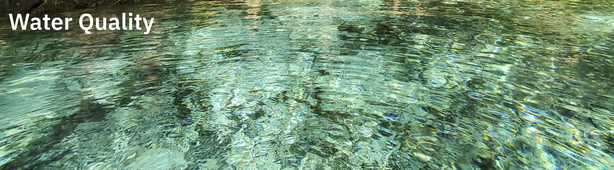
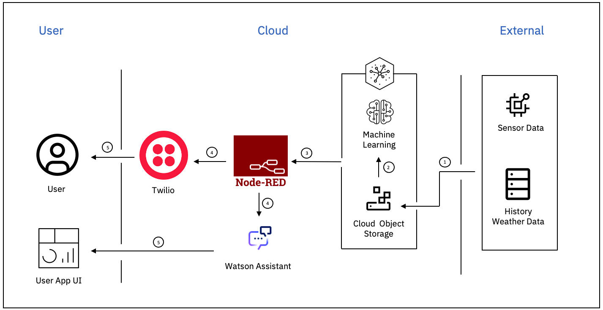

# Overview

Florida's springs, rivers, and estuaries define the natural aesthetic of the state and are primarily responsible for establishing Florida as the 16th largest economy in the world. However, these waterways' physical, chemical, and biological conditions are dramatically changing due to climate change and pollution. These changes pose a threat to the people and wildlife that depends on Florida's aquatic resources. Water, being a precious life-giving resource, must be protected. 

# Possible Solution

Monitor contaminants that can pose a threat to the water quality and aquatic life.

# Idea

Lead contaminated water can pose severe damage to the internal organs of both human and aquatic life. Develop a system to monitor and predict lead levels in the water.

### Know More About Lead Contamination

- [Florida's Get the Lead Out Campaign](https://environmentflorida.org/feature/fle/get-lead-out)
- [Basic Information about Lead in Drinking Water](https://www.epa.gov/ground-water-and-drinking-water/basic-information-about-lead-drinking-water)
- [Lead Factsheet from Florida Health](http://www.floridahealth.gov/environmental-health/drinking-water/_documents/lead-fs.pdf)
- [Monitoring Lead and Copper in Florida Drinking Water](https://floridadep.gov/water/source-drinking-water/content/monitoring-lead-and-copper-florida-drinking-water)

## Architecture

## Solution Flow

### Real-time Monitoring System

- Collect data from sensors monitoring lead content in water and store in the IBM Cloud Object Storage.
- Use Node-Red to monitor the lead content threshold.
- Use twilio to trigger push notification to the registered user when the threshold is crossed.

### Prediction System

- Use historic weather data to support the lead contamination prediction system and and store in the IBM Cloud Object Storage.
- Create a model that predicts weather factors that contributes to the water contamination using Watson Studio.
- Deploy the tested model on Watson Studio and get the endpoint URL.
- Run the model in intervals and when the prediction cross the threshold, Node-Red will trigger Watson Assistant.
- Watson Assistant will then start chat with the registered user with a list of possible ways to combat the possible contamination. User can use the app to connect with the Watson Assistant.

# Resources

## Developer Resources

- [IBM Developer](https://developer.ibm.com/) - Searchable webpage with videos, code patterns, and tutorials to get you started

## Technology

- [Watson Studio Learning Path](https://developer.ibm.com/components/watson-studio/)
- [IBM Cloud Object Storage](https://cloud.ibm.com/docs/cloud-object-storage?topic=cloud-object-storage-getting-started-cloud-object-storage)
- [Machine Learning API Documentation](https://cloud.ibm.com/apidocs/machine-learning)
- [Watson Assistant Learning Path](https://developer.ibm.com/components/watson-assistant/learningpaths/get-started-watson-assistant/)
- [IBM Accelerator Catalog](https://community.ibm.com/accelerators/)
- [Connect Watson Assistant with Node-Red](https://www.ibm.com/cloud/blog/create-a-chatbot-on-ibm-cloud-and-integrate-with-slack-part-1)
- [Cognos Analytics Dashboard API](https://www.ibm.com/docs/en/cognos-analytics/11.1.0?topic=dashboards-creating-dashboard)

## Container Services

-  [IBM Cloud Kubernetes Service](https://www.ibm.com/cloud/kubernetes-service)
-  [IBM Cloud Container Registry](https://www.ibm.com/cloud/container-registry)

## Data & AI Services

- [IBM Watson Studio](https://www.ibm.com/cloud/watson-studio)
- [IBM CloudPak for Data](https://www.ibm.com/products/cloud-pak-for-data)
- [AI Code Patterns](https://developer.ibm.com/?q=%20&DWContentType[0]=Code%20patterns&DWTechnology[0]=Artificial%20intelligence)
- [Data Science Code Patterns](https://developer.ibm.com/?q=%20&DWContentType[0]=Code%20patterns&DWTechnology[0]=Data%20science)
- [ML Code Patterns](https://developer.ibm.com/?q=%20&DWContentType[0]=Code%20patterns&DWTechnology[0]=Machine%20learning)
- [Watson Studio Code Patterns](https://developer.ibm.com/?q=%20&DWContentType[0]=Code%20patterns&DWComponent[0]=Watson%20Studio)

## Dataset

- [WMS Flowing Waters Resource 2020](https://geodata.dep.state.fl.us/datasets/wms-flowing-waters-resource-2020/explore)
- [Recreational Fishing Data Downloads](https://www.fisheries.noaa.gov/recreational-fishing-data/recreational-fishing-data-downloads)

# Authors

- [Saishruthi Swaminathan](https://www.linkedin.com/in/saishruthi-swaminathan/)
