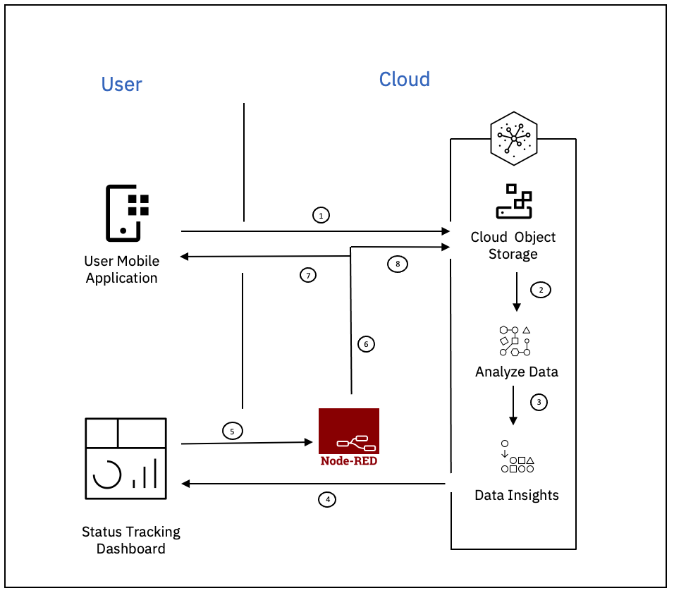

# Overview

Florida’s 8,000 miles of coastline exhibit tremendous natural beauty, attracting tourists, and enriching the lives of the state’s 15 million coastal residents. Changes in weather patterns, extreme events, deoxygenation of ocean waters, ongoing erosion, and human development are disrupting and degrading Florida's coastal ecosystems, including beaches, dunes, seagrass meadows, oyster and coral reefs, and wetlands. Reducing emissions is key to helping with climate change. 

# Possible Solution

Target and reduce emissions from vehicles.

# Idea

Building a voluntary program to track people using walk/bike/public transport as a means of transportation. Reward based on the usage.

## Architecture

## Solution Flow

- Use the mobile application to log the mode of transportation and store the data in the IBM Cloud Object Storage.
- Analyze the logged data 
- Extract insights from data and update the status tracking dashboard.
- The authroity responsible for monitoring the dashboard, can trigger reward based on the usage.
- Information about the reward is updated in the application and stored in the IBM Cloud Object Storage 

# Resources

## Developer Resources

- [IBM Developer](https://developer.ibm.com/) - Searchable webpage with videos, code patterns, and tutorials to get you started

## Technology

- [Watson Studio Learning Path](https://developer.ibm.com/components/watson-studio/)
- [IBM Cloud Object Storage](https://cloud.ibm.com/docs/cloud-object-storage?topic=cloud-object-storage-getting-started-cloud-object-storage)
- [Machine Learning API Documentation](https://cloud.ibm.com/apidocs/machine-learning)
- [Watson Assistant Learning Path](https://developer.ibm.com/components/watson-assistant/learningpaths/get-started-watson-assistant/)
- [IBM Accelerator Catalog](https://community.ibm.com/accelerators/)
- [Connect Watson Assistant with Node-Red](https://www.ibm.com/cloud/blog/create-a-chatbot-on-ibm-cloud-and-integrate-with-slack-part-1)
- [Cognos Analytics Dashboard API](https://www.ibm.com/docs/en/cognos-analytics/11.1.0?topic=dashboards-creating-dashboard)

## Container Services

-  [IBM Cloud Kubernetes Service](https://www.ibm.com/cloud/kubernetes-service)
-  [IBM Cloud Container Registry](https://www.ibm.com/cloud/container-registry)

## Data & AI Services

- [IBM Watson Studio](https://www.ibm.com/cloud/watson-studio)
- [IBM CloudPak for Data](https://www.ibm.com/products/cloud-pak-for-data)
- [AI Code Patterns](https://developer.ibm.com/?q=%20&DWContentType[0]=Code%20patterns&DWTechnology[0]=Artificial%20intelligence)
- [Data Science Code Patterns](https://developer.ibm.com/?q=%20&DWContentType[0]=Code%20patterns&DWTechnology[0]=Data%20science)
- [ML Code Patterns](https://developer.ibm.com/?q=%20&DWContentType[0]=Code%20patterns&DWTechnology[0]=Machine%20learning)
- [Watson Studio Code Patterns](https://developer.ibm.com/?q=%20&DWContentType[0]=Code%20patterns&DWComponent[0]=Watson%20Studio)

## Dataset
- [WMS Flowing Waters Resource 2020](https://geodata.dep.state.fl.us/datasets/wms-flowing-waters-resource-2020/explore)
- [Recreational Fishing Data Downloads](https://www.fisheries.noaa.gov/recreational-fishing-data/recreational-fishing-data-downloads)

## Examples
- [Create a real-time object detection app using WatsonML](https://developer.ibm.com/patterns/create-a-real-time-object-detection-app-using-watson-machine-learning/)
- [IoT hub for streaming, storing, and analyzing sensor data](https://developer.ibm.com/tutorials/integration-of-iot-cloud-and-ai/)

# Authors

- [Saishruthi Swaminathan](https://www.linkedin.com/in/saishruthi-swaminathan/)
- [Mrinalini Sugosh](https://www.linkedin.com/in/mrinasugosh)
